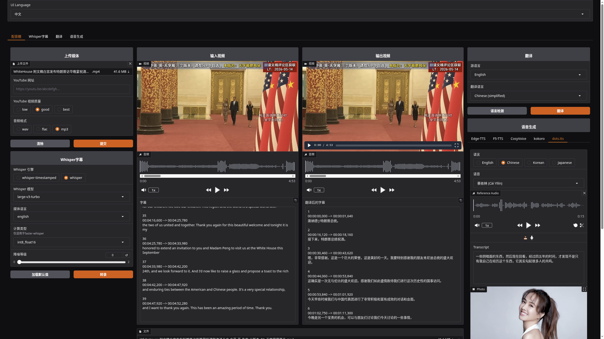

# voice-simple

`voice-simple` 是 [abus-aikorea/voice-pro](https://github.com/abus-aikorea/voice-pro) 精简分支，当前只保留真实可用主线：`Linux x86_64 + NVIDIA + uv`。

当前仓库只覆盖 4 个页面：

- `Dubbing Studio`
- `Whisper subtitles`
- `Translation`
- `Speech Generation`

不再支持或维护：

- Windows / macOS 主流程
- conda / `installer_files` / one-click
- AI Cover / Karaoke / RVC / VSR / Live Translation / Batch TTS
- 旧静态站点、旧多语言 README、旧脚本入口

## 界面截图



## 支持范围

- 操作系统：`Linux x86_64`
- GPU：`NVIDIA`
- Python：`3.10.15`
- PyTorch：`2.8.0+cu128`
- CUDA 轮子基线：`cu128`
- 包管理与启动：`uv`

不支持：

- CPU-only
- Windows / macOS 主路径
- `conda`
- 旧 `start.bat` / `configure.bat` / one-click 安装流

## 环境要求

系统先装好：

- `uv`
- `git`
- `ffmpeg`
- `espeak-ng`
- 可工作的 NVIDIA 驱动

Debian / Ubuntu：

```bash
sudo apt update
sudo apt install -y git ffmpeg build-essential espeak-ng
curl -LsSf https://astral.sh/uv/install.sh | sh
```

建议先确认：

```bash
nvidia-smi
uv --version
ffmpeg -version
espeak-ng --version
```

## 安装

仓库根目录执行：

```bash
uv sync
```

`uv sync` 会：

- 解析 `.python-version` 并安装 `Python 3.10.15`
- 创建项目虚拟环境
- 安装 CUDA 12.8 对应 PyTorch 轮子
- 安装 `whisperx`、`kokoro`、`f5-tts`、`dots-tts`、`onnxruntime-gpu` 等依赖

## 启动

推荐命令：

```bash
uv run voice-simple
```

等价命令：

```bash
uv run python start-voice-simple.py
```

后台启动辅助脚本：

```bash
./start-linux.sh
```

默认本地地址：

```text
http://127.0.0.1:7860
```

## 环境验证

先验证 CUDA：

```bash
uv run python -c "import torch; print(torch.__version__); print(torch.cuda.is_available())"
```

再验证核心依赖：

```bash
uv run python -c "import gradio, onnxruntime, whisperx, kokoro, f5_tts, dots_tts.runtime"
```

再验证主入口：

```bash
uv run voice-simple
```

## 首次运行与模型下载

首次启动会自动准备部分模型与素材，速度可能较慢。当前启动链会预取：

- `demucs`
- `Edge-TTS` 示例音色素材
- `kokoro` 示例音色与 `eSpeak NG` 资源
- `CosyVoice` 示例音色与模型包

另外：

- `F5-TTS` / `E2-TTS` 首次推理会下载所选模型权重
- `dots.tts` 首次推理会从 Hugging Face 下载所选权重
- `whisper` / `faster-whisper` / `whisper-timestamped` / `whisperX` 首次使用时会下载对应模型

目录约定：

- 工作区：`./workspace`
- Gradio 临时目录：`./workspace/gradio`
- 模型目录：`./model`

## 页面与流程

### 1. 语音识别

页面：

- `Dubbing Studio`
- `Whisper subtitles`

基本流程：

1. 上传音频或视频，或填写 YouTube URL。
2. 选择 ASR 引擎。
3. 选择模型、语言、去噪等级。
4. 执行转写，生成字幕文本与字幕文件。

关键区别：

- `Whisper subtitles` 页面支持 `faster-whisper`、`whisper`、`whisper-timestamped`、`whisperX`
- `Dubbing Studio` 页面只支持 `whisper-timestamped`、`whisper`
- `Dubbing Studio` 默认与推荐使用 `whisper-timestamped`
- 之前 README 把两个页面写混了；当前代码真实行为以上面为准
- `Compute Type` 仅对 `Whisper subtitles` 页面里的 `faster-whisper` 生效
- `Denoise Level` 会先调用 `demucs` 做分离再转写，首次运行会更慢

输出：

- `.srt`、`.vtt`、`.tsv`、`.txt`、`.json`
- 工作区中的中间音频 / 视频文件

### 2. 翻译

页面：

- `Translation`
- `Dubbing Studio` 内置翻译区

基本流程：

1. 导入字幕文件或直接粘贴文本。
2. 选择源语言与目标语言。
3. 执行翻译。
4. 导出翻译后文本或字幕文件。

说明：

- 普通文本会按句切分再翻译
- 字幕会逐条翻译，并按 TTS 需要做轻量预处理
- 配置可用时优先使用 `Azure Translator`
- 未配置 Azure 时默认走 `deep-translator`

### 3. 配音

页面：

- `Speech Generation`
- `Dubbing Studio` 内置配音区

基本流程：

1. 输入翻译后文本，或导入字幕文件。
2. 选择 TTS 引擎与模型。
3. 根据引擎填写参考音频、参考文本、语言、步数、语速等参数。
4. 执行合成，生成音频文件。

说明：

- 文本输入会按句切分后逐句合成
- 字幕输入会按时间轴逐句合成并拼接
- 长字幕文件会明显更慢，尤其 `F5-TTS`、`CosyVoice`、`dots.tts`

### 4. Dubbing Studio 端到端流程

推荐顺序：

1. 上传媒体
2. 转字幕
3. 检查字幕文本
4. 选择源语言与目标语言并翻译
5. 选择 TTS 引擎与参数
6. 合成配音音频或视频

这个页面适合单文件端到端处理。如果只做局部能力，分别去 `Whisper subtitles`、`Translation`、`Speech Generation` 更直接。

## 支持引擎与模型

### 语音识别

- `faster-whisper`
  - 页面：`Whisper subtitles`
  - 参考音频：不需要
  - 特点：支持 `Compute Type`
- `openai-whisper`
  - 页面：`Whisper subtitles`、`Dubbing Studio`
  - 界面显示名：`whisper`
  - 参考音频：不需要
- `whisper-timestamped`
  - 页面：`Whisper subtitles`、`Dubbing Studio`
  - 参考音频：不需要
  - 说明：`Dubbing Studio` 默认与推荐选项
- `whisperX`
  - 页面：`Whisper subtitles`
  - 参考音频：不需要
  - 说明：首次初始化通常较慢，对 CUDA / cuDNN 更敏感

### 翻译

- `deep-translator`
  - 页面：`Translation`、`Dubbing Studio`
  - 配置：默认可用
- `Azure Translator`
  - 页面：`Translation`、`Dubbing Studio`
  - 配置：需要 `.env`
  - 必填变量：`AZURE_TRANSLATOR_KEY`、`AZURE_TRANSLATOR_ENDPOINT`、`AZURE_TRANSLATOR_REGION`

### 配音

- `Edge-TTS`
  - 页面：`Speech Generation`、`Dubbing Studio`
  - 参考音频：不需要
  - 特点：启动快，适合标准配音
- `Azure TTS`
  - 页面：`Speech Generation`、`Dubbing Studio`
  - 参考音频：不需要
  - 配置：需要 `.env`
- `F5-TTS`
  - 页面：`Speech Generation`、`Dubbing Studio`
  - 参考音频：可选
  - 特点：高质量，长文本较慢
- `E2-TTS`
  - 页面：`Speech Generation`、`Dubbing Studio`
  - 从属关系：作为 `F5-TTS` 体系可选模型使用
  - 参考音频：可选
- `CosyVoice`
  - 页面：`Speech Generation`、`Dubbing Studio`
  - 参考音频：需要
  - 特点：支持 `Zero-Shot`、`Cross-Lingual`、`Instruct`
- `kokoro`
  - 页面：`Speech Generation`、`Dubbing Studio`
  - 参考音频：不需要
  - 特点：轻量，启动快
- `dots.tts`
  - 页面：`Speech Generation`、`Dubbing Studio`
  - 参考音频：需要
  - 特点：首次下载权重较慢，长字幕逐句合成较慢

## Azure 配置

如需启用 `Azure Translator` / `Azure TTS`，在项目根目录放 `.env`，至少包含：

```env
AZURE_TRANSLATOR_KEY=...
AZURE_TRANSLATOR_ENDPOINT=...
AZURE_TRANSLATOR_REGION=...
AZURE_SPEECH_KEY=...
AZURE_SPEECH_REGION=...
```

未配置时：

- 翻译默认走 `deep-translator`
- 语音默认走 `Edge-TTS`

## 常见问题

### `uv sync` 失败

- 先看 `uv --version`
- 再看 `python3 --version`
- 网络慢时重试 `uv sync`
- 代理环境下确认 PyPI / Hugging Face 可访问

### 首次启动慢

- 首次需要下载模型与示例素材
- `demucs`、`whisperX`、`dots.tts` 首次都可能明显慢
- 第二次启动通常快很多

### CUDA / cuDNN / `whisperX` 报错

- 只走支持路径：`uv run voice-simple` 或 `uv run python start-voice-simple.py`
- 不要绕过启动器直接改 `LD_LIBRARY_PATH`
- 先确认 `torch.cuda.is_available()` 返回 `True`

### `Dubbing Studio` 里为什么没有 `faster-whisper` 和 `whisperX`

- 这是当前代码的有意限制，不是 UI 漏项
- 这两个引擎在 `Dubbing Studio` 端到端流程里更容易卡死或不稳定
- 需要它们时，去 `Whisper subtitles` 页面单独转字幕

### 模型下载慢

- `dots.tts`、`F5-TTS`、`CosyVoice` 会从 Hugging Face 拉权重
- 网络差时可多次重试

### 后台启动看日志

- `./start-linux.sh` 模式下可看 `/tmp/voice-simple.log`

## 常用命令

```bash
uv sync
uv run voice-simple
uv run python start-voice-simple.py
./start-linux.sh
```
